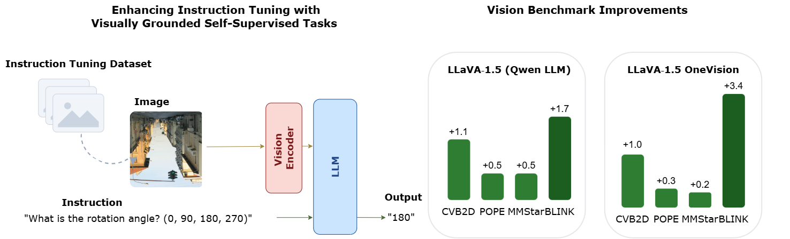

<div align="center">
<h1>
Boosting Visual Instruction Tuning with Self-Supervised Guidance
<br>
</h1>

<h2>
V-GIFT: Visually Grounded Instruction Fine-Tuning
<br>
<br>
<a href="https://scholar.google.com/citations?user=3ac3PQMAAAAJ&hl=fr">Sophia Sirko-Galouchenko</a>&ensp;
<a href="https://wysoczanska.github.io/">Monika Wysoczanska</a>&ensp;
<a href="https://abursuc.github.io/">Andrei Bursuc</a>&ensp;
<a href="https://thome.isir.upmc.fr">Nicolas Thome</a>&ensp;
<a href="https://scholar.google.com/citations?user=7atfg7EAAAAJ&hl=fr">Spyros Gidaris</a>&ensp;
</h2>

<p></p>
<a href="https://arxiv.org/abs/2604.12966"></a>



</div>

## Abstract

<em> Multimodal large language models (MLLMs) perform well on many vision-language tasks but often struggle with vision-centric problems that require fine-grained visual reasoning. Recent evidence suggests that this limitation arises not from weak visual representations, but from under-utilization of visual information during instruction tuning, where many tasks can be partially solved using language priors alone. We propose a simple and lightweight approach that augments visual instruction tuning with a small number of visually grounded self-supervised tasks expressed as natural language instructions. By reformulating classical self-supervised pretext tasks, such as rotation prediction, color matching, and cross-view correspondence, as image-instruction-response triplets, we introduce supervision that cannot be solved without relying on visual evidence. Our approach requires no human annotations, no architectural modifications, and no additional training stages. Across multiple models, training regimes, and benchmarks, injecting only a small fraction (3-10%) of such visually grounded instructions consistently improves performance on vision-centric evaluations. Our findings highlight instruction tuning with visually grounded SSL tasks as a powerful lever for improving visual reasoning in MLLMs through simple adjustments to the training data distribution. </em>

---

## Environment
### LLaVA 1.5 
```
git clone https://github.com/sirkosophia/V-GIFT.git
cd V-GIFT 
conda create -n vgiftllava python=3.10 -y       
conda activate vgiftllava
cd llava 
pip install -e .
pip install -e ".[train]"
pip install flash-attn==2.6.3 --no-build-isolation
pip install peft==0.4.0
pip install transformers==4.36.2 --no-deps
```

## Datasets 
See [Preparing Datasets for V-GIFT](docs/datasets.md) for details on how to download and create the datasets.


## Training

V-GIFT fine-tuning supports two model families:

### LLaVA (Vicuna-7B / Qwen2.5-7B)

Download model weights into `llava/checkpoints/`:

| Weight | Source |
|---|---|
| `vicuna-7b-v1.5` | https://huggingface.co/lmsys/vicuna-7b-v1.5 |
| `clip-vit-large-patch14-336` | https://huggingface.co/openai/clip-vit-large-patch14-336 |
| `llava-v1.5-7b-pretrain/mm_projector.bin` | https://huggingface.co/liuhaotian/llava-v1.5-mlp2x-336px-pretrain-vicuna-7b-v1.5 |
| `qwen_25_instruct` | https://huggingface.co/Qwen/Qwen2.5-7B-Instruct |
| `llava-v1.5-qwen25-pretrain/mm_projector.bin` | *(pretrain checkpoint)* |

Then run fine-tuning from the repo root:

```bash
# Vicuna-based
bash llava/scripts/v1_5/finetune_full_vicuna_v_gift.sh

# Qwen2.5-based
bash llava/scripts/v1_5/finetune_full_qwen_v_gift.sh
```

Checkpoints are saved to `checkpoints/llava-v1.5-7b/finetune_full_vicuna_v_gift/` and `checkpoints/llava-v1.5_qwen/finetune_full_qwen_v_gift/` respectively. Override the run name with `CUSTOM_NAME=my_run bash llava/scripts/v1_5/finetune_full_vicuna_v_gift.sh`.


### LLaVA 1.5 OneVision 

Download model weights into `./onevision/checkpoints/`:

Download  `LLaVA-OneVision-1.5-4B-stage0` model directly from [Hugging Face](https://huggingface.co/lmms-lab/LLaVA-OneVision-1.5-4B-stage0).

Download `LLaVA-OneVision-1.5-4B-Base` model directly from [Hugging Face](https://huggingface.co/lmms-lab/LLaVA-OneVision-1.5-4B-Base).

Convert the model from Hugging Face format to Megatron format:

```bash
AIAK_TRAINING_PATH=./onevision bash examples/llava_ov_1_5/convert/convert_4b_hf_to_mcore.sh \
onevision/checkpoints/LLaVA-OneVision-1.5-4B-Base \
onevision/checkpoints/LLaVA-OneVision-1.5-4B-Base-mcore \
1 1
```


Run the finetuning:

```bash
# Launch
AIAK_TRAINING_PATH=./onevision \
DATA_PATH=./onevision/configs/metadataset_v_gift.yaml \
TOKENIZER_PATH=./onevision/checkpoints/LLaVA-OneVision-1.5-4B-stage0 \
CHECKPOINT_PATH=./onevision/checkpoints/LLaVA-OneVision-1.5-4B-Base-mcore \
bash ./onevision/examples/llava_ov_1_5/quick_start/stage_2_instruct_llava_ov_4b.sh
```


For evaluation convert weights from mcore to Hugging Face format
```bash
AIAK_TRAINING_PATH=./onevision \
bash examples/llava_ov_1_5/convert/convert_4b_mcore_to_hf.sh \
stage_2_instruct_llava_ov_4b/iter_0003500 \
LLaVA-OneVision-1.5-4B-3M-Mid-Training-780K-Instruct \
1 1
# Copy non-model files (e.g., tokenizer config) to the new directory
find LLaVA-OneVision-1.5-4B-stage0/ -type f -not -iname '*safetensors*' -exec cp {}  LLaVA-OneVision-1.5-4B-3M-Mid-Training-780K-Instruct/ ';'
```

## Download Weights

Pre-trained V-GIFT model weights are available on Hugging Face:

| Model | Link |
|---|---|
| V-GIFT LLaVA 1.5 Vicuna-7B | https://huggingface.co/SophiaSirko/V-GIFT_llava_v1.5_vicuna7b |
| V-GIFT LLaVA 1.5 Qwen2.5-7B | https://huggingface.co/SophiaSirko/V-GIFT_llava_v1.5_qwen2.5_7B |

## Citation

```
@misc{sirkogalouchenko2026boostingvisualinstructiontuning,
      title={Boosting Visual Instruction Tuning with Self-Supervised Guidance}, 
      author={Sophia Sirko-Galouchenko and Monika Wysoczanska and Andrei Bursuc and Nicolas Thome and Spyros Gidaris},
      year={2026},
      eprint={2604.12966},
      archivePrefix={arXiv},
      primaryClass={cs.CV},
      url={https://arxiv.org/abs/2604.12966}, 
}
```

## Acknowledgements
This repo relies on the following projects:

[LLaVA: Visual Instruction Tuning](https://github.com/haotian-liu/LLaVA?tab=readme-ov-file#train)

[LLaVA-OneVision-1.5](https://github.com/EvolvingLMMs-Lab/LLaVA-OneVision-1.5)

[VIRAL: Visual Instruction Tuning via Reinforcement Learning](https://github.com/cvlab-kaist/VIRAL)
