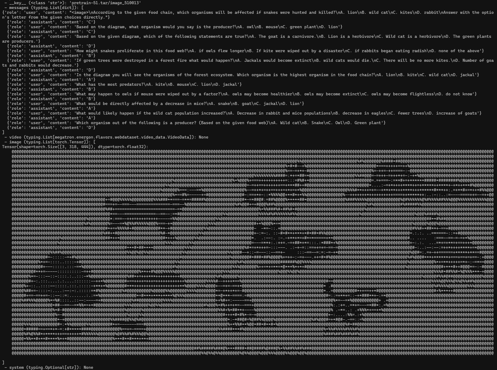

# SFT Data Preprocessing

### 1.🐳 Docker (Recommended)

We strongly recommend using the docker environment for a seamless experience.

```bash
# Clone repository
git clone https://github.com/EvolvingLMMs-Lab/LLaVA-OneVision-1.5.git
cd LLaVA-OneVision-1.5

docker build -t llava_megatron:25.04 .

# Run container with -w to set working directory directly to the mounted volume
docker run -it --gpus all \
    --ipc host --net host --privileged --cap-add IPC_LOCK \
    --ulimit memlock=-1 --ulimit stack=67108864 --rm \
    -v $(pwd):/workspace/LLaVA-OneVision-1.5 \
    -w /workspace/LLaVA-OneVision-1.5 \
    --name "llava_megatron_container" \
    llava_megatron:25.04 /bin/bash
```

## 2\. Data Download

Download LLaVA-NeXT-780k at [🤗HF/LLaVA-NeXT-780k](https://huggingface.co/datasets/lmms-lab/LLaVA-NeXT-Data)


## 3\. Execute the WebDataset Conversion

### 3.1. Raw Data Processing
Here we provide the code guidance to convert the dataset into the format of LLaVA-OneVision.

```python
import os
import json
import pandas as pd
from PIL import Image
from io import BytesIO
from tqdm import tqdm

PARQUET_DIR = "LLaVA-NeXT-Data/data"
OUTPUT_IMAGE_DIR = "images"
OUTPUT_JSON_FILE = "mllm_mix.json"

os.makedirs(OUTPUT_IMAGE_DIR, exist_ok=True)
merged_data = []

for filename in tqdm(sorted(f for f in os.listdir(PARQUET_DIR) if f.endswith('.parquet'))):
    df = pd.read_parquet(os.path.join(PARQUET_DIR, filename), columns=['id', 'conversations', 'image'])
    for _, row in df.iterrows():
        messages = [{"content": msg["value"], "role": "user" if msg["from"]=="human" else "assistant"} for msg in row['conversations'].tolist()]
        data = {"id": row['id'], "messages": messages}
        if row['image'] is not None:
            img = Image.open(BytesIO(row['image']['bytes']))
            ext = 'jpg' if img.format in ['JPEG', 'JPG'] else 'png'
            img_name = f"{row['id']}.{ext}"
            img_path = os.path.join(OUTPUT_IMAGE_DIR, img_name)
            os.makedirs(os.path.dirname(img_path), exist_ok=True)
            img.save(img_path)
            data["images"] = [img_name]
        merged_data.append(data)

with open(OUTPUT_JSON_FILE, 'w', encoding='utf-8') as f:
    json.dump(merged_data, f, ensure_ascii=False, indent=4)

```

An example of JSON format is as follows:
```json
{
    "id": "000000033471",
    "messages": [
        {
            "role": "user",
            "content": "<image>\nWhat are the colors of the bus in the image?\nAnswer the question with GPT-T-COCO format."
        },
        {
            "role": "assistant",
            "content": "The bus in the image is white and red."
        }
    ],
    "images": [
        "000000033471.jpg"
    ]
}
```


### 3.2. WebDataset Generation

Run the conversion script, providing the necessary arguments based on your data type.

```bash
python tools/data_preprocess/convert_to_webdataset.py \
    --output_dir wds \
    --json_file mllm_mix.json \
    --image_dir images \
    --maxcount 10000
```
Key Parameters
| Parameter | Type | Required | Description |
| :--- | :--- | :--- | :--- |
| **`--output_dir`** | `str` | Yes | The directory to save the final WebDataset files |
| **`--json_file`** | `str` | Yes | The path to the main JSON file containing the dataset metadata. |
| **`--image_dir`** | `str` | No | The directory path containing the image files. Required if **media** is **image** or **mix**. |
| **`--video_dir`** | `str` | No | The directory path containing the video files. Required if **media** is **image** or **mix**. |
| **`--media`** | `str` | No | The type of media to process: **image**, **video**, or **mix** (default: **mix**). |
| **`--maxcount`** | `int` | No | Maximum number of samples per WebDataset shard (default: $10000$). |
| **`--maxsize`** | `int` | No | Maximum byte size of each shard (default: $3$ GB). |
| **`--columns_messages`** | `str` | No | The key in the JSON entry that holds the conversational messages (default: **messages**). |


## 4\. Verifying the Conversion (Optional)
To ensure the conversion was successful and the data loader can correctly interpret your new Energon dataset, use the preview command.
```bash
energon preview wds
```
If the images are displayed correctly, the conversion was successful.
Here is an example:


