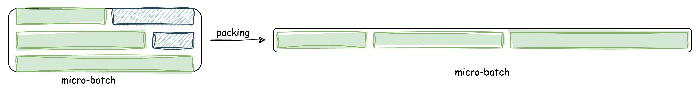
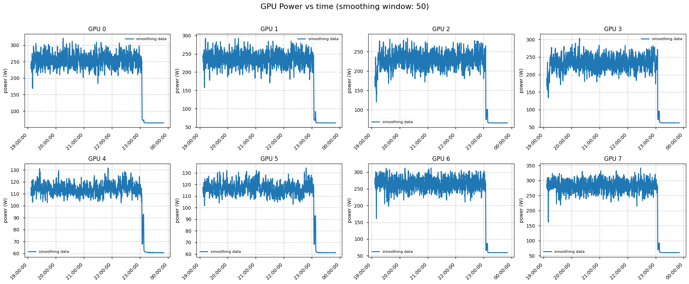
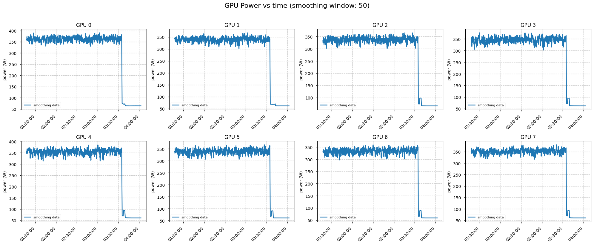

<!-- # Offline sample-packing for multimodal datasets -->
<h1 align="center">Offline sample-packing for multimodal datasets</h1>

## Essential Knowledge About Sample-Packing
- What is sample-packing？
  > Multiple samples are concatenated into a single long sequence to form a “packed-sample,” reducing padding (an implementation of padding-free) and improving GPU utilization.   
  > 
- Why sample-packing is necessary?
  > Avoiding FLOPs spent on padding tokens: When samples of very different lengths are batched together, padding forces unnecessary FLOPs on meaningless positions.       
  > Avoiding inter-GPU waiting: Within a micro-step, large discrepancies in padded lengths across devices create load imbalance, forcing faster GPUs to wait for slower ones.     
  > Reducing compute jitter: On the same GPU, the amount of padding (and thus FLOPs) can vary sharply across micro-steps, causing large swings in utilization.    
  > Avoiding training crashes (OOM) caused by padding-to-longest: Padding to the longest sample makes memory jump quadratically with that sample’s length; one outlier can blow up the batch and trigger OOM.

  > GPU power variation during training with non-packed samples
  > 
  > 
  > GPU power variation during training with packed samples
  > 
- A functional breakdown of a complete sample-packing workflow
  > 1) How to import samples/packed-samples into the training pipeline through the data-loading and preprocessing libraries.     
  > 2) How samples in the original dataset are consolidated into packed-samples.
  > 3) How packed-samples are handled during computation—both with and without cross-attention between them—by leveraging FlashAttention’s `flash_attn_varlen_func`.
- Why opt for offline sample-packing?
  > In the current implementations within LLaMA-Factory and Megatron, sample-packing is performed online: each data-loader thread first loads  packing_buffer_size  samples and then packs them on the fly.     
  > let DP=$N$, total samples = $M$，and number of data-loader threads = $n$    
  > $$ packing\_buffer\_size ≤ M/(N*n) $$
  > Too small a buffer under-packs, so we still pad everything to max_length and waste FLOPs; too large a buffer tries to pack the whole shard in RAM and can OOM the host before training even starts.


  > Offline sample-packing eliminates these trade-offs altogether：
  > 1) Global-length-aware scheduling packs across the entire shard, cutting padding to the theoretical minimum.
  > 2) Packing is finished before training starts, so the host RAM footprint never scales with buffer size—no more OOM kills.
  > 3) The data-loader simply reads pre-built packed sequences, shrinking CPU-GPU sync points and iteration jitter to zero.
  
----
## Offline Sample-Packing on AIAK-Megatron: Design, Implementation & Usage


### Sample format
Here, three types of formats are involved：
- The formats of the original dataset, such as captions, VQA, and QA.
- Pre-packing sample formats: either  `{img, json}`  pairs or pure `json`.
    - pretrain: `{img, json}` pairs (Standard Captions and VQA Formats)
    - sft:
        <!-- - `{img, json}` pairs for samples with image. -->
        - <details><summary><code>`{img, json}` pairs for samples with image</code> </summary>
          
            ```json
            {
                "messages": [
                    {
                        "content": "<image>\nWho is the author of this book?\nAnswer the question using a single word or phrase.",
                        "role": "user"
                    },
                    {
                        "content": "Kevin J. Todeschi",
                        "role": "assistant"
                    },
                    {
                        "content": "What is the genre of this book?",
                        "role": "user"
                    },
                    {
                        "content": "Religion & Spirituality",
                        "role": "assistant"
                    },
                    {
                        "content": "Is this book related to Business & Money?",
                        "role": "user"
                    },
                    {
                        "content": "No",
                        "role": "assistant"
                    }
                ],
                "images": [
                    "876044011.jpg"
                ]
            }
            
          In the original dataset, the processing method for multiple pieces of data (multimodal data) corresponding to the same image:
          1) Split into multiple {json, img} pairs, ensuring no duplicate names (for example, the processing method below):            
              > 000000003474.jpg     
              > 000000003474.json    
              > 000000003474_1.jpg    
              > 000000003474_1.json    
              > 000000003474_2.jpg    
              > 000000003474_2.json    
          2) Merge multiple pieces of data into a single multi-turn dialogue format (the order does not matter), but it is necessary to pay attention to the total length after merging.      
        <!-- - `__img--output_\d{8}\.json` (regex) for samples without image. -->
        - <details><summary><code>output_\d{8}\.json` (regex) for samples without image</code> </summary>
     
          Here, the value corresponding to the "images" key is [].

        
            ```json
            {
                "messages": [
                    {
                        "content": "Express the system configuration diagram and structure that fits the theme of metaverse-based aftercare service prototype implementation\nAnswer in English.지금 번역하기",
                        "role": "user"
                    },
                    {
                        "content": "A metaverse-based aftercare service prototype ...... provides a virtual environment for users to interact with the aftercare services.",
                        "role": "assistant"
                    }
                ],
                "images": []
            }
            
- Post-packing format: a single packed-sample that keeps only the effective data—i.e., the actual contents—from each original sample.
    - pretrain(captions, VQA):
      ```shell
      raw_packing_data/   
        ├── ps_00000000.img000.jpg   
        ├── ps_00000000.img001.jpg   
        ├── ps_00000000.img002.jpg   
        ├── ps_00000000.json   
      ```
          
      JSON format (captions & vqa data)
      ```json
        {
          "images": ["img000.jpg", "img001.jpg", "img002.jpg"],
          "prompt": ["描述", "what about...", ""],
          "captions": ["str0", "str1", "str2"]
        }
      ```
    - sft(multi-turn conversations + mixed datasets):
      ```shell
      raw_packing_data/   
        ├── ps_00000000.img000.jpg   
        ├── ps_00000000.img002.jpg        
        ├── ps_00000000.json      
      ```
      JSON format (multi-round + blend data)
      ```json
        {
          "images":   [["img000.jpg"], [], ["img002.jpg"]],
          "prompt":   [["描述这幅图"], ["what about this fig"], ["How are you?", "I am fine too."]],
          "captions": [["stri"], ["str2"], ["I am fine and you?", "Have a nice day"]]
        }
      ```   

### Basic Idea of Packing Operation
#### Ralated data-structures
- Information about one sample 
```python
    DTYPE_SAMPLE_INFO = np.dtype([
        ("w", np.uint16), 
        ("l", np.uint16),      
        ("name", "U256")  
    ])
```
- Hash-Bucket for storing entire dataset samples     
  keys: all possible `l` values from the DTYPE_SAMPLE_INFO structure.      
  value for one key: all DTYPE_SAMPLE_INFO instances with the same `l` value.

#### Bin-Packing Strategy  

Objective: Convert all samples into packed-samples while packing as fully as possible.    
Multi-Strategy Phased Packing (let, the length of the packed-sample is $box\_capacity = 2^N$. A total of m steps are required.):
- 1st, process all samples with a token count of $\{2^n | n ∈ [0, N]\}$, ensuring full packed. The packing process consists of two stages: first, prioritize diversity by attempting to include as many different types of keys as possible in each packed-sample; if a deadlock occurs due to all bins having the same number of remaining items, allow one strategy switch—abandoning the diversity goal and adopting a purely greedy approach to fill the packed-sample to capacity，and then back to prioritize diversity.
- 2nd, grouping with seeds (the first sample in each pack) by packing all samples with a token count > $box\_capacity/2$ as seeds, performing multi-threaded parallel packing (with optional limits on sample count and minimum packed length).”
- 3rd...(m-1), multi-strategy seed packing: select seeds using various methods, then perform multi-threaded parallel packing (with configurable limits on the number of samples per pack and the minimum packed length).
- mth, specified seed packing for finalization work: Multi-threaded parallel packing + single-threaded packing algorithm in LlamaFactory for finalization.

#### Data Processing in the Training Pipeline

- Restore packed samples into multiple original data pieces according to parameters/environment variables.
- Convert this original data into tokens using a tokenizer.
- Apply the template (for captions) or chat-template to the original data, and convert it into tokens using a tokenizer.
- Concatenate the tokens of each sample together, with emphasis on recording the cu_lengths for `flash_attn_varlen_func`.
```python
n_orig_sample = len(sample.images)
l_Qwen2VLImageTaskSample = []

for idx in range(n_orig_sample):
    # tokenizer for vqa
    if int(os.environ.get("OFFLINE_PACKING_VQA", 0)) == 1:
        cur_capsample = VQASample(
            __key__=f"{sample.__key__}.img{idx:03d}_jpg",
            __restore_key__=sample.__restore_key__,
            __subflavor__=None,
            __subflavors__=sample.__subflavors__,
            image=sample.images[idx],
            answers=sample.captions[idx],
            context=sample.prompts[idx]
        )                    
        l_Qwen2VLImageTaskSample.append(self.encode_vqa4packing(cur_capsample))
    # tokenizer for (multi-round + blend data)
    elif int(os.environ.get("OFFLINE_PACKING_BMR", 0)) == 1:
        def convert_to_messages(cur_prompt, cur_caption):
            """
            {cur_prompt, cur_caption}---> messages
            """
            if len(cur_prompt) != len(cur_caption):
                raise ValueError("cur_prompt & cur_caption have different lengths")
            
            messages = []
            for prompt, caption in zip(cur_prompt, cur_caption):
                messages.append({
                    "content": prompt,
                    "role": "user"
                })
                messages.append({
                    "content": caption,
                    "role": "assistant"
                })
            
            return messages

        cur_capsample = MultiMixQASample(
            __key__=f"{sample.__key__}.img{idx:03d}_jpg",
            __restore_key__=sample.__restore_key__,
            __subflavor__='BMR',
            __subflavors__=sample.__subflavors__,
            messages=convert_to_messages(sample.prompts[idx], sample.captions[idx]),
            video=None,
            system=None,
            image=[sample.images[idx]] if sample.images[idx] else None
        )                    
        l_Qwen2VLImageTaskSample.append(self.encode_multi_mix_qa(cur_capsample))
    # tokenizer for captions
    else:
        cur_capsample = CaptioningSample(
            __key__=f"{sample.__key__}.img{idx:03d}_jpg",
            __restore_key__=sample.__restore_key__,
            __subflavor__=None,
            __subflavors__=sample.__subflavors__,
            image=sample.images[idx],
            caption=sample.captions[idx]
        )
        l_Qwen2VLImageTaskSample.append(self.encode_captioning(cur_capsample))

# Concatenate the tokens of the original samples, with emphasis on recording the cu_lengths.
l_sample_packed = self.pack_selected_samples(l_Qwen2VLImageTaskSample)

```

### How To Use

#### General Workflow Overview 
All data processing follows this sequence:
- Step-1: Compute per-sample token count after applying the chosen chat-template.
- Step-2: Run bin-packing (merge variable-length samples into a fixed-token-length batch) and switch from pre-packing format to post-packing format.
- Step-3: Export the post-packing-format batches into WebDataset tar shards.
- Step-4: Set environment variables for training on the offline-packed shards.

#### CAPTIONS Dataset Example 

##### Required files(`./captions-packing`):
All dataset-related settings below come with working defaults, but they are only placeholders—replace them with your actual paths, splits and column names before production use.
- s1_config_emova_captions_300k-8k.yaml - step1 config
- s1_get_tokenlens_v2.py - complete step-1 pipeline (compute token lengths)
- sandbox_packing_captions.ipynb - interactive bin-packing algorithm
- s2_prepare_rawsamples-emova_captions_pretrain_300k-8k.py - convert pre-packing format to post-packing format (step-2 data transform only)
- s3_test-emova_captions_300k-8k.sh - step-3 pipeline (tar-shard packaging)

##### CAPTIONS Workflow
Change to the actual path.
- Step-1: `python s1_get_tokenlens_v2.py --config ./configs/s1_config_emova_captions_300k-8k.yaml`
- Step-2: `sandbox_packing_captions.ipynb`
    - section `Step2-1`: bin-packing processing (You can set different bin-packing strategies and their parameters based on your understanding of the element distribution in the hash_buckets.).
    - section `hash_buckets‘s element distribution`: Visualize the element distribution in hash_buckets to help design bin-packing strategies.
    - section `Step2-2`: Convert pre-packing format to post-packing format.
- Step-3: `bash s3_test-emova_captions_300k-8k.sh`
- Step-4: `export OFFLINE_PACKED_DATA='1'`(Settings in the training script remain unchanged).


<!-- <details>
<summary><b>s1_config_emova_captions_300k-8k.yaml</b> – step1 config</summary>

| Parameter | Description | Default |
|-----------|-------------|---------|
| `task_type` | task type | pretrain |
| `max_len` | maximum packed-sample length | 8192 |
| `{min_pixels, max_pixels, max_aspect_ratio}` | image preprocessing parameters (match model config) | {3136, 4014080, 200} |

</details>

<details>
<summary><b>s1_get_tokenlens_v2.py</b> – complete step-1 pipeline (compute token lengths)</summary>

| Var | Meaning |
|-----|---------|
| `CAP_TEMPLATE` | `template for ` | 

</details>

<details>
<summary><code>data_config.yaml</code> 关键片段</summary>

```yaml  # 行号默认开启，hljs 高亮
# ========= 装箱部分 =========
seq_len: 8192          # 单箱最大 token 数
pack_frac: 0.95        # 填充率 ≥0.9 即可

# 以下两项控制样本加权
sample_weight:
  captions: 1.0        # 普通 caption 权重
  qa: 2.0             # QA 对权重翻倍
```
</details> -->


#### VQA Dataset Example 
An example for automatically processing the LLaVA-One-Vision-1.5-Mid-Training-85 dataset is provided in directory `.../LLaVA-OneVision-1.5/examples/llava_ov_1_5/sample_packing`.

> 🚧 Example (A multi-step pipeline for processing custom datasets) coming soon

#### Multi-Turn Conversations + Mixed Dataset Example (testing in progress)
##### Required files(`bmr_packing`):
All dataset-related settings below come with working defaults, but they are only placeholders—replace them with your actual paths, splits and column names before production use.
- s1_bmr_sft_data_proc_indcoding.py - (Optional) Process the dataset into the required format (splitting it into {json, img} file pairs or a standalone json file).
- s1_config_BMR_sft_780k.yaml - step1 config
- s1_get_tokenlens_v4-sft.py - complete step-1 pipeline (compute token lengths)
- sandbox_packing_captions.ipynb - interactive bin-packing algorithm
- s2_prepare_rawsamples-bmr_sft_780k-8k-fast.py - convert pre-packing format to post-packing format (step-2 data transform only)
- s3_test_bmr_sft_780k-8k.sh - step-3 pipeline (tar-shard packaging)

##### Multi-Turn Conversations + Mixed Workflow
- Step-1: 
    - `python s1_bmr_sft_data_proc_indcoding.py 2>&1 tee ./logs/output.log`
    - `python s1_get_tokenlens_v4-sft.py --config ./configs/s1_config_MR_sft_780k.yaml`
- Step-2: `s2_bmr_sft_packing.ipynb`
    - section `Step2-1`: bin-packing processing (You can set different bin-packing strategies and their parameters based on your understanding of the element distribution in the hash_buckets.).
    - section `hash_buckets‘s element distribution`: Visualize the element distribution in hash_buckets to help design bin-packing strategies.
    - section `Step2-2`: Convert pre-packing format to post-packing format.
- Step-3: `bash s3_test_mr_sft_780k-8k.sh`
- Step-4: `export OFFLINE_PACKED_DATA='1' & export OFFLINE_PACKING_BMR='1'`(Settings in the training script remain unchanged).


<!-- > 🚧 Example coming soon -->


### TODO Implementation

- [ ] A unified pipeline that merges the processing code for captions, VQA, and multi-turn conversations + mixed datasets.  
- [ ] Ray-cluster-based processing.

### How You Can Get Involved 
We welcome every form of contribution—no matter how small.
- Try it out: open issues for bugs, confusing logs, or missing docs.
- Share data: contribute the packing strategy (tracker.print_summary's output) you tuned for your-own/public datasets.
- Submit PRs: fix typos, add tests, or prototype the next feature on the Roadmap.
- Spread the word: blog, tweet, or cite us if the code helps your project.


